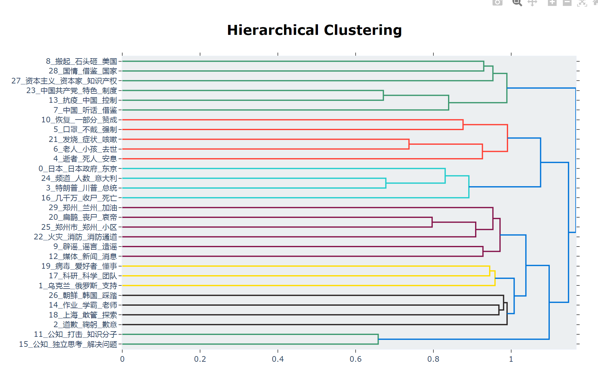
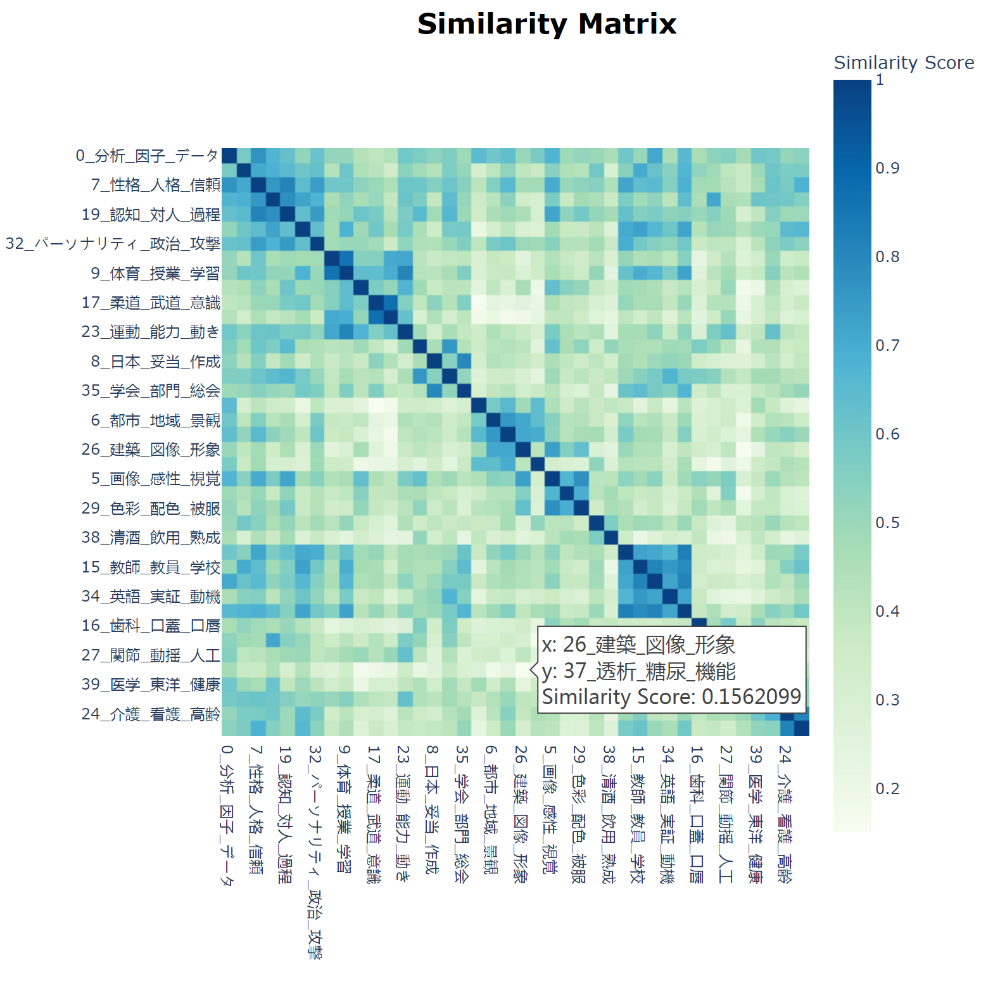
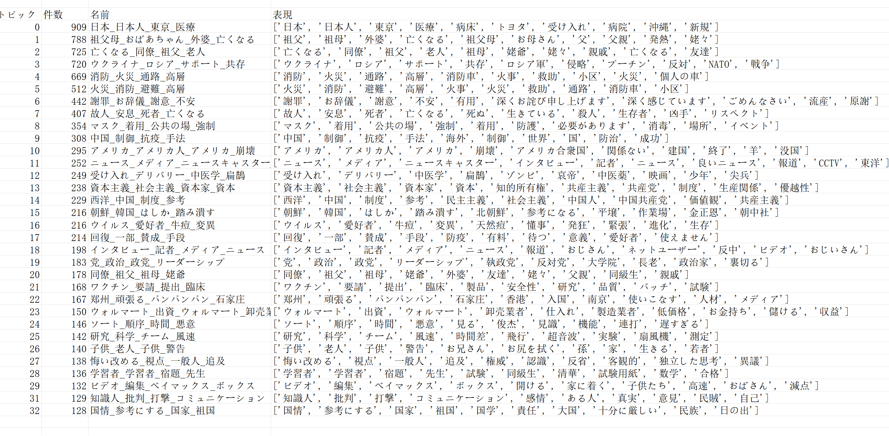
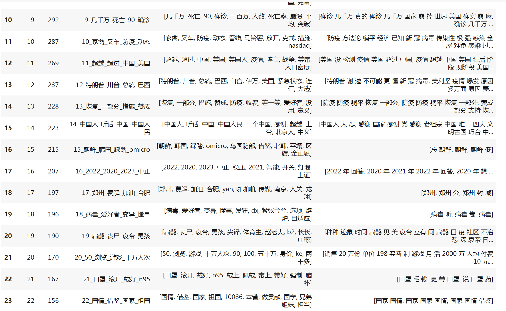

# Welcome to My Website!

Explore topics:

1. [Discover the Wonders of Distance](distancemap.html)
   - Dive into the captivating world of distance exploration!

2. [Uncover the Evolution of Topics Over Time](jikan.html)
   - Witness how topics evolve and change with the passage of time.

## Preview the Visual Delights:

### Cluster Map

### Heatmap

### Successful Version and Japanese Translation (Machine-Translated, Excuse Imperfections)

### Note: The following example serves as a learning experience!

---

### What's New?

