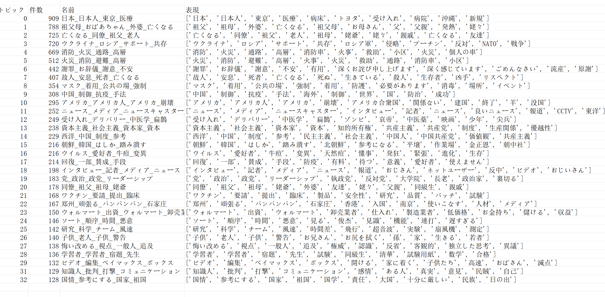

<html lang="en">
<head>
  <meta charset="UTF-8">
  <meta name="viewport" content="width=device-width, initial-scale=1.0">
  <title>Welcome to My Website!</title>
  

</head>
<body>

  <h1>Welcome to My Website!</h1>

  
Here I have included some pictures, which are a visual analysis of Chinese citizens’ comments to the zero-coivd policy.

  <section>
    <h2>Explore topics:</h2>

    <h3>1. <a href="distancemap.html">Discover the Wonders of Distance</a></h3>
    
Dive into the captivating world of distance exploration!

    <iframe src="distancemap.html" frameborder="0"></iframe>

    <h3>2. <a href="jikan.html">Uncover the Evolution of Topics Over Time</a></h3>
    
Witness how topics evolve and change with the passage of time.

    <iframe src="jikan.html" frameborder="0"></iframe>
  </section>

  <section>
    <h2>Co-occurrence Network Visualization</h2>

    
<a href="kyoki.html">This is a co-occurrence network of several thousand submissions from January to April 2021</a>

    
I used <a href="https://pyvis.readthedocs.io/en/latest/">pyvis</a> to draw this visualization.

    <iframe src="kyoki.html" frameborder="0"></iframe>
  </section>

  <section>
    <h2>Preview the Visual Delights:</h2>

    <h3>Cluster Map</h3>
    

    <h3>Heatmap: Research Paper Titles on Factor Analysis</h3>
    
I gathered titles from approximately 1000 Japanese research papers related to factor analysis. Using BERTopic, I generated a heatmap illustrating the covariance matrix.

    

    <h3>Successful Version and Japanese Translation (Machine-Translated, Excuse Imperfections)</h3>
    
           
    
         

    <h3>Note: The following example serves as a learning experience! This corpus contains stop words, numbers, and irrelevant vocabulary.</h3>
    
  </section>

</body>
</html>

---

